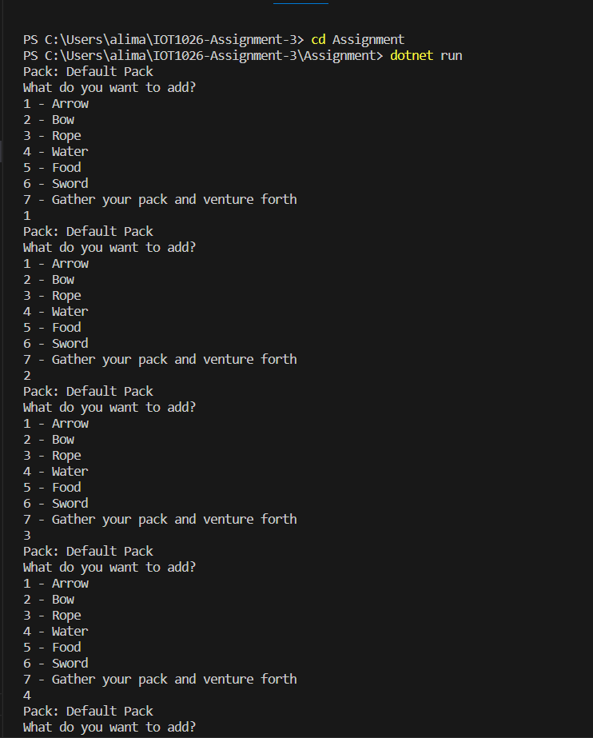

	
	<a href="https://github.com/arigrg/IOT1026-Assignment-3/actions/workflows/formatting.yml">
    
	 
    

# IOT1026-Assignment-3
Write a description of the project here and don't forget to update the badges.       
 
It is a .net program used for managing inventory items and packs. In this program, we have a container for storing inventory items, with methods to add items and track their count, volume, and weight. The InventoryItem class is an abstract base class for different types of inventory items, providing methods to retrieve their volume and weight. The code also includes derived classes for specific inventory items such as arrows, bows, ropes, water, food, and swords, each with their own characteristics and string representations. Overall, the code sets up a framework for managing inventory items within packs, allowing for customization of item types and their properties. 
    

Output Image:

        
[Assignment Instructions](docs/instructions.md)  
[How to start coding](docs/how-to-use.md)  
[How to update status badges](docs/how-to-update-badges.md)
